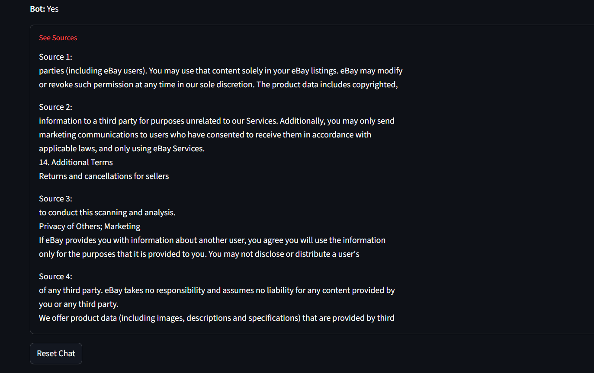

# 📜 Legal RAG Chatbot

A Retrieval-Augmented Generation (RAG) chatbot built with a Streamlit frontend that answers questions based on a legal document (User Agreement). Developed as part of the Amlgo Labs Junior AI Engineer Assessment.

---

## 📌 Features

- RAG pipeline using `FAISS` and `MiniLM` embeddings
- Streaming responses using `Streamlit`
- Contextual answers grounded in retrieved document chunks
- Displays source text used for each answer
- Reset chat functionality

---

## 🧠 Architecture Overview

1. **Preprocessing**: Legal document is chunked and embedded
2. **Retrieval**: Uses FAISS to retrieve top-k relevant chunks
3. **Generation**: Combines retrieved context with prompt
4. **Interface**: Streamlit for real-time user interaction

---

## 🔧 Folder Structure

├── app.py
├── requirements.txt
├── README.md
├── report.pdf
├── /data
│ └── user_agreement.pdf
├── /chunks
│ └── chunked_docs.txt
├── /vectordb
│ └── index.faiss, index.pkl
├── /src
├ └──retriever.py
├ └──generator.py
└ └──rag_pipeline.py
├── /notebooks
│ └──preprocess.py


---

## 🏗️ Setup & Installation

```bash
# Create a virtual environment (optional)
python -m venv venv
source venv/bin/activate  # or venv\Scripts\activate on Windows

# Install requirements
pip install -r requirements.txt

##RUNNING:
# Run preprocessing (creates chunks and vector DB)
python src/preprocess.py
#run UI
streamlit run app.py
#MOdel downloading might occur and will take some time, in the first run.


🧪 Sample Queries
"Who am I entering into contract with when using eBay?"

"What are the limitations of liability in the agreement?"

"Who is responsible for disputes between buyers and sellers?"


🧠 Model & Embedding
LLM: google/flan-t5-small

Embeddings: all-MiniLM-L6-v2

Vector Store: FAISS (local)


#PROMPT TEMPLATE
Answer the following question using the provided context:

Context: {retrieved_chunks}

Question: {user_query}

🔍 Limitations
Answers depend on quality of retrieved chunks

May hallucinate if context is irrelevant or missing

flan-t5-small is a lightweight model – may struggle with very nuanced questions


📽️ Demo Video / Screenshots

